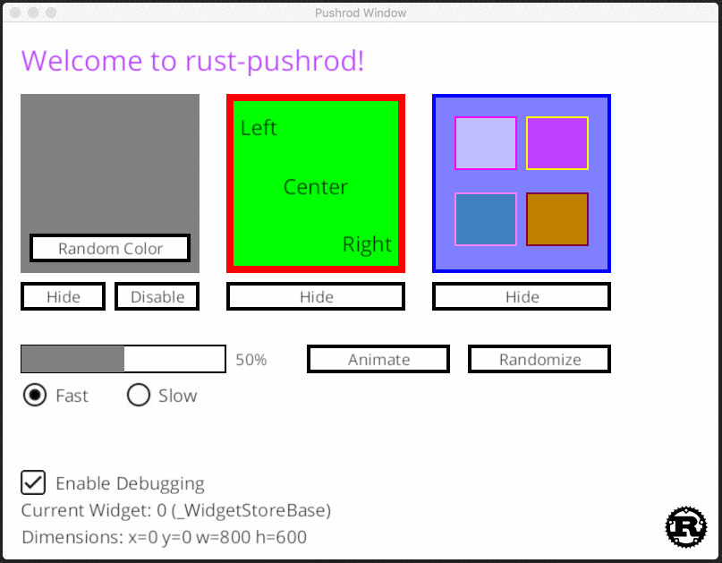

# rust-pushrod

[](https://travis-ci.org/KenSuenobu/rust-pushrod)
[](https://crates.io/crates/rust-pushrod)
[](https://docs.rs/rust-pushrod)

**Cross Platform UI Widget Library for Rust.**

Draws inspiration from lots of GUI libraries.

## (Ever Evolving) Screenshot of Sample

[](docs/sample-0.2.9.gif)

## Philosophy

The reason I created this library instead of extending another library was that
I wanted to keep these specific design ideas in mind:

- Maintainable with little effort
- Easily extensible
- Lightweight enough to run on minimalist hardware
- **Easy to use and understand**

These design ideas are critical.  **Keep it simple.  Keep it stupid simple.**

## Prerequisites for Pushrod

Pushrod requires the following minimum versions:

| Library | Version |
| ------- | ------- |
| piston_window | 0.89 |
| pistoncore-glfw_window | 0.49 |
| lazy_static | 1.3 |
| rust | 2018 |

This library requires the use of `glfw`.  To install this on Ubuntu Linux,
you will want to run the following commands:

```
sudo apt install libglfw3 libglfw3-dev xorg-dev
```

This will install `libglfw`, the development libraries, and all of the
X11 headers and libraries required to compile `glfw`.

## Runnable Examples

```
cargo run --example simple
```

This will only test window-related events with mouse interaction: mouse enter, mouse exit, mouse click, mouse
pointer move, and mouse scroll.

