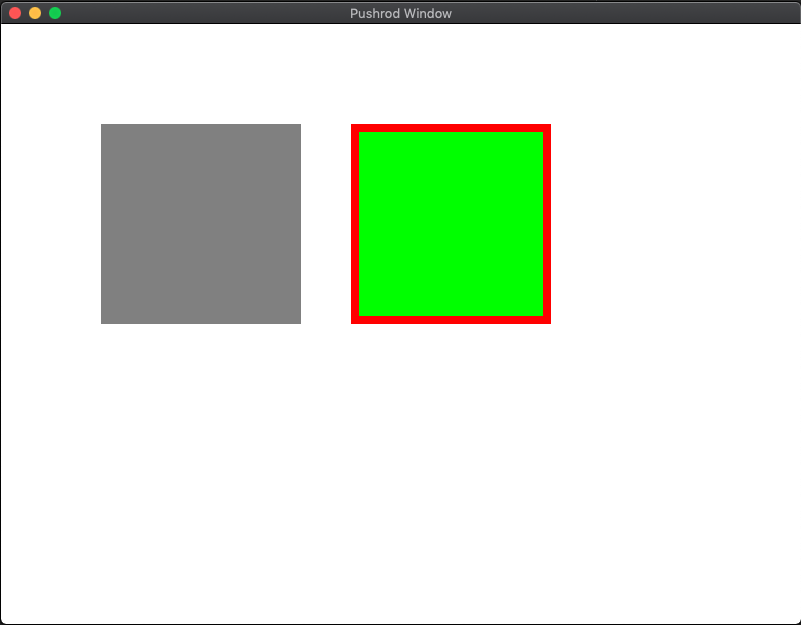

# rust-pushrod

**Cross Platform UI Widget Library for Piston.**

Draws inspiration from Atari GEM, TrollTech Qt, and others.

[](https://travis-ci.org/KenSuenobu/rust-pushrod)
[](https://crates.io/crates/rust-pushrod)

Current state of the sample app:

[](docs/sample.png)

## Philosophy

The reason I created this library instead of extending another library was that
I wanted to keep these specific design ideas in mind:

- Maintainable with little effort
- Easily extensible
- **Easy to use and understand**

These design ideas are critical.  **Keep it simple.  Keep it stupid simple.**

## Prerequisites for Pushrod

Pushrod requires the following minimum versions:

| Library | Version |
| ------- | ------- |
| piston_window | 0.87.0 |
| piston2d-opengl_graphics | 0.59.0 |
| gfx_core | 0.8.3 |
| gfx_device_gl | 0.15.5 |
| rust | 2018 |

## Runnable Examples

```
cargo run --example simple
```

This will only test window-related events with mouse interaction: mouse enter, mouse exit, mouse click, mouse
pointer move, and mouse scroll.

