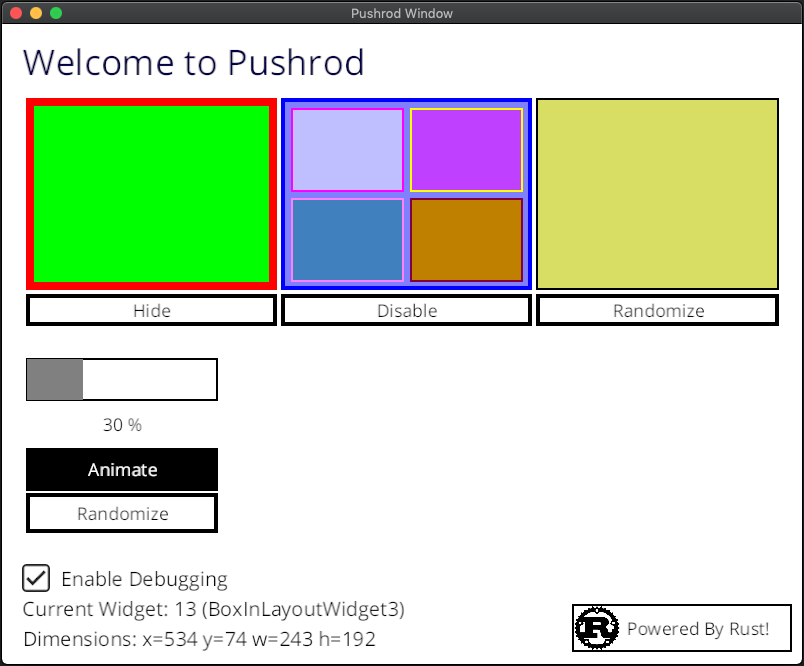
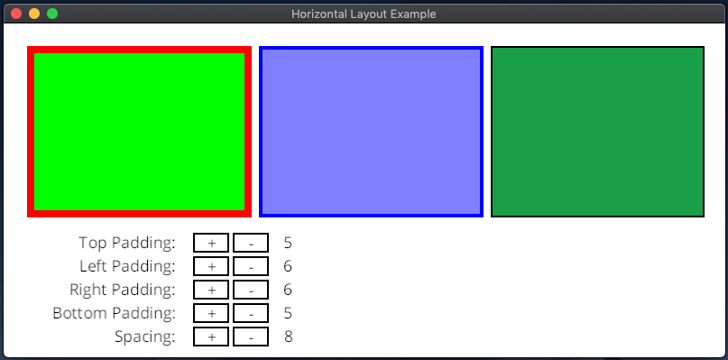

# rust-pushrod

## Project Description

[](https://travis-ci.org/KenSuenobu/rust-pushrod)
[](https://crates.io/crates/rust-pushrod)
[](https://docs.rs/rust-pushrod)

**Cross Platform UI Widget Library for Rust that uses OpenGL as its rendering engine.**

Draws inspiration from lots of GUI libraries.

If you like this library, please consider [donating to this project!](https://www.patreon.com/KenSuenobu)

## (Ever Evolving) Screenshot of Sample

[](docs/sample-0.3.7.png)

## Horizontal Layout Sample

[](docs/hlayout.png)

## 0.4.x Status

- [x] Fix build so that it builds on TravisCI for both OSes properly
- [x] New traits for optimization:
  - [x] `Drawable`
  - [x] `InjectableSystemEvents`
  - [x] `InjectableCustomEvents`
- [x] Update Piston to the latest release
- [x] Fix hidden object traversal in main draw loop
- [x] Pass in event system trait so that `Widget`s have access to the `Widgets` from the `WidgetStore`
- [x] Add helper methods to access widgets by name and invalidate via Widget vector
- [x] Add Callbacks:
  - [x] On Click without number of clicks
  - [x] Mouse Moved
  - [x] Widget Toggled
  - [x] Timer Tick
  - [x] Mouse Button Down
  - [x] Mouse Button Up
  - [x] Mouse Entered
  - [x] Mouse Exited
- [ ] Modify Event system so that it is a single trait
- [ ] Get rid of Point and Size, use array value types instead
- [ ] Fix all `Widget`s so that they draw to a texture
- [ ] Fix Invalidation such that it walks the children so that drawing is done in order
- [x] Horizontal Layout sample application
- [ ] Vertical Layout sample application
- [ ] Update documentation
- [ ] Widget offset updates (adding a child origin based on parent)
- [ ] Optimizations to screen invalidation
- [ ] Optimizations to drawing (every object is a 3D texture, not just blitting to a master texture)
- [ ] Layout Manager optimizations (call `do_update` at the end of layout)
- [ ] `PageWidget`: page controller to contain and swap displays of different pages of containers
- [ ] `GridLayoutContainer`: layout objects equally sized in a grid
- [ ] `ToolboxWidget`: layout that displays clickable images and captioned text
- [ ] `HorizontalSpaceWidget`: horizontal spacer for layout containers
- [ ] `VerticalSpaceWidget`: vertical spacer for layout containers
- [ ] `DropdownMenuWidget`: displays a dropdown menu with selectable items in a list
- [ ] `SplitContainerWidget`: splits two displays horizontally or vertically by a resizable spacer
- [ ] `GridWidget`: displays a grid (either by lines or dots) evenly spaced by a grid snap offset
- [ ] `TabWidget`: displays a series of tabs that can be used with the `PageWidget` to control page switching
- [ ] `PopupMenuWidget`: displays a dropdown menu anywhere on the screen based on the mouse offset
- [ ] `Viewport`: container that is larger than the screen that can be repositioned
- [ ] `SliderWidget`: displays a slideable box in a bounding box, allowing for content to be scrolled
- [ ] `MenuBar`: creates a menu bar at the top of the window that can be used to interact with the app
- [ ] Layout for dialog boxes and/or form displays
- [ ] Modal Alert box either by a new window or by a static modal dialog box that disables the top-level container
- [ ] (De)serialization library for widgets to file
- [ ] Modification of main application to use (de)serialization for layout

Please [see here](https://github.com/KenSuenobu/rust-pushrod/milestone/5) for more details on issues.

## Philosophy

The reason I created this library instead of extending another library was that
I wanted to keep these specific design ideas in mind:

- Maintainable with little effort
- Easily extensible
- Lightweight enough to run on minimalist hardware
- **Easy to use and understand**

These design ideas are critical.  **Keep it simple.  Keep it stupid simple.**

## Prerequisites for Pushrod

Pushrod requires the following minimum versions:

| Library | Version |
| ------- | ------- |
| piston_window | 0.89 |
| piston2d-opengl_graphics | 0.59 |
| piston2d-graphics | * |
| pistoncore-glfw_window | 0.49 |
| gl | * |

## Optimization Note

To see what the CPU usage looked like before and after switching between 2D and 3D rendering engines,
[here is before](docs/cpu_before.png), and [this is after](docs/cpu_after.png).  These numbers represent the
current version (0.3.x) before any rendering optimizations have been added.

So, is it worth it to add OpenGL?  I'll let you decide.

## Runnable Examples

### Pre-Requisite for Mac OS X

You should use `brew` on your system.  If you have Homebrew already installed, use `brew install glfw` to 
install the `GLFW` formula.

## After installing pre-requisites:

```
cargo run --example simple
```

This will run the simple application demo.  It's interactive, so have fun!
